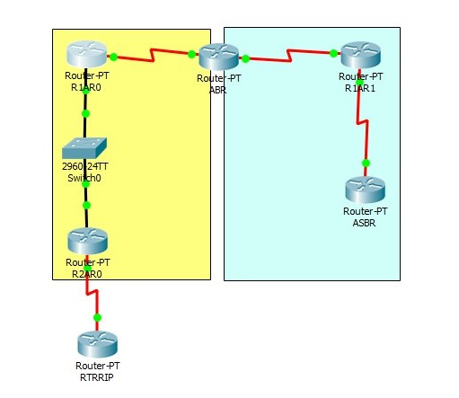

# Практика. OSPF

Аристархова Светлана (КН-202). 
n = 1

К уже настроенной на паре сети добавляем еще один роутер RTRRIP.



#### R2AR0
```
Router>en
Router#conf t
Router(config)#int loop 0
Router(config-if)#ip address 10.11.0.1 255.255.255.255
Router(config-if)#exit
Router(config)#int loop 1
Router(config-if)#ip address 10.11.1.1 255.255.255.255
Router(config-if)#exit
Router(config)#int loop 2
Router(config-if)#ip address 10.11.2.1 255.255.255.255
Router(config-if)#exit
Router(config)#int loop 3
Router(config-if)#ip address 10.11.3.1 255.255.255.255
Router(config-if)#exit
Router(config)#router rip
Router(config-router)#version 2
Router(config-router)#network 10.0.0.0
Router(config-router)#exit
Router(config)#router ospf 1
Router(config-router)#redistribute rip subnets
Router(config-router)#end
```

#### R1AR0
```
R1AR0#show ip route
     172.20.0.0/24 is subnetted, 4 subnets
O E2    172.20.0.0 [110/20] via 10.2.2.2, 00:38:22, FastEthernet0/0
O E2    172.20.1.0 [110/20] via 10.2.2.2, 00:38:22, FastEthernet0/0
O E2    172.20.2.0 [110/20] via 10.2.2.2, 00:38:22, FastEthernet0/0
O E2    172.20.3.0 [110/20] via 10.2.2.2, 00:08:42, FastEthernet0/0
```

#### RTRRIP
```
Router>en
Router#conf t
Router(config)#int se2/0
Router(config-if)#no shut
Router(config-if)#description CONNECTION TO R2AR0
Router(config-if)#ip address 10.3.3.2 255.255.255.0
Router(config-if)#exit
Router(config)#router rip
Router(config-router)#version 2
Router(config-router)#no auto-summary
Router(config-router)#network 10.0.0.0
Router(config-router)#network 172.20.0.0
Router(config-router)#exit
Router(config)#int loop 0
Router(config-if)#ip address 172.20.0.1 255.255.255.0
Router(config-if)#exit
Router(config)#int loop 1
Router(config-if)#ip address 172.20.1.1 255.255.255.0
Router(config-if)#exit
Router(config)#int loop 2
Router(config-if)#ip address 172.20.2.1 255.255.255.0
Router(config-if)#exit
Router(config)#int loop 3
Router(config-if)#ip address 172.20.3.1 255.255.255.0
Router(config-if)#end
```

#### ABR, R1AR0, ASBR
```
Router>en
Router#conf t
Router(config)#router ospf 1
Router(config-router)#area 1 stub
Router(config-router)#end
```

#### ABR
```
Router>en
Router#conf t
Router(config)#router ospf 1
Router(config-router)#area 1 stub no-summary
Router(config-router)#end
```

#### R1AR1, ASBR
```
Router>en
Router#conf t
Router(config)#router ospf 1
Router(config-router)#no area 1 stub
Router(config-router)#area 1 nssa
Router(config-router)#end
```

#### ABR
```
Router>en
Router#conf t
Router(config)#router ospf 1
Router(config-router)#area 1 nssa
Router(config-router)#area 1 nssa default-information-originate
Router(config-router)#end
```

#### ASBR
```
Router>en
Router#conf t
Router(config)#router ospf 1
Router(config-router)#redistribute static subnets
Router(config-router)#end
```