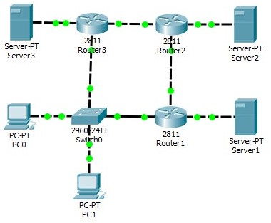

# Практика. RIP

Аристархова Светлана (КН-202). 
n = 1

Создаем сеть, как показано на картинке в задании 2. В каждый Router (1-3) добавляем модуль NM-1FE-TX.  



## Настройка Роутеров

#### Router 1

```
Router>en
Router#conf t
Router(config)#int fa0/0
Router(config-if)#ip address 192.168.10.1 255.255.255.252
Router(cofig-if)#no shutdown
Router(config-if)#exit

Router(config)#int fa0/1
Router(config-if)#ip address 10.1.1.1  255.255.255.0
Router(cofig-if)#no shutdown
Router(config-if)#exit

Router(config)#int fa1/0
Router(config-if)#ip address 192.168.1.1 255.255.255.0
Router(cofig-if)#no shutdown
Router(config-if)#exit
Router(config)#exit
Router#write memory
```

#### Router 2

```
Router>en
Router#conf t
Router(config)#int fa0/0
Router(config-if)#ip address 192.168.10.2 255.255.255.252
Router(cofig-if)#no shutdown
Router(config-if)#exit

Router(config)#int fa0/1
Router(config-if)#ip address 192.168.10.6  255.255.255.252
Router(cofig-if)#no shutdown
Router(config-if)#exit

Router(config)#int fa1/0
Router(config-if)#ip address 192.168.2.1 255.255.255.0
Router(cofig-if)#no shutdown
Router(config-if)#exit
Router(config)#exit
Router#write memory
```

#### Router 3

```
Router>en
Router#conf t
Router(config)#int fa0/0
Router(config-if)#ip address 10.1.1.2 255.255.255.0
Router(cofig-if)#no shutdown
Router(config-if)#exit

Router(config)#int fa0/1
Router(config-if)#ip address 192.168.10.5  255.255.255.252
Router(cofig-if)#no shutdown
Router(config-if)#exit

Router(config)#int fa1/0
Router(config-if)#ip address 192.168.3.1 255.255.255.0
Router(cofig-if)#no shutdown
Router(config-if)#exit
Router(config)#exit
Router#write memory
```

## Назначаем IP

#### Server 1:

```
IP Adress:     192.168.1.11
Subnet Mask:   255.255.255.0
```

#### Server 2:

````
IP Adress:     192.168.2.11
Subnet Mask:   255.255.255.0
````

#### Server 3:

````
IP Adress:     192.168.3.11
Subnet Mask:   255.255.255.0
````

#### PC 0:

`````
IP Adress:       10.1.1.11
Subnet Mask:     255.255.255.0
Default gateway: 10.1.1.2
`````

#### PC 1:

````
IP Adress:       10.1.1.12
Subnet Mask:     255.255.255.0
Default gateway: 10.1.1.2
````

## Запускаем протокол RIP

#### Router 1

```
Router>en
Router#conf t
Router(config)#router rip
Router(config-router)# network 192.168.10.0
Router(config-router)# network 10.1.1.0
Router(config-router)# network 192.168.1.0
```

#### Router 2

```
Router>en
Router#conf t
Router(config)#router rip
Router(config-router)# network 192.168.10.0
Router(config-router)# network 192.168.10.4
Router(config-router)# network 192.168.2.0
```

#### Router 3

```
Router>en
Router#conf t
Router(config)#router rip
Router(config-router)# network 10.1.1.0
Router(config-router)# network 192.168.10.4
Router(config-router)# network 192.168.3.0
```

## Результаты

#### Router 1

```
Router>en
Router#show ip interface brief 
Interface              IP-Address      OK? Method Status                Protocol 
FastEthernet0/0        192.168.10.1    YES manual up                    up 
FastEthernet0/1        10.1.1.1        YES manual up                    up 
FastEthernet1/0        192.168.1.1     YES manual up                    up 
Vlan1                  unassigned      YES unset  administratively down down
```

```
Router#show ip rip database 
10.1.1.0/24    auto-summary
10.1.1.0/24    directly connected, FastEthernet0/1
192.168.1.0/24    auto-summary
192.168.1.0/24    directly connected, FastEthernet1/0
192.168.2.0/24    auto-summary
192.168.2.0/24
    [1] via 192.168.10.2, 00:00:28, FastEthernet0/0
192.168.3.0/24    auto-summary
192.168.3.0/24
    [1] via 10.1.1.2, 00:00:01, FastEthernet0/1
192.168.10.0/30    auto-summary
192.168.10.0/30    directly connected, FastEthernet0/0
192.168.10.4/30    auto-summary
192.168.10.4/30
    [1] via 192.168.10.2, 00:00:28, FastEthernet0/0
```

```
Router#show ip route
Codes: C - connected, S - static, I - IGRP, R - RIP, M - mobile, B - BGP
       D - EIGRP, EX - EIGRP external, O - OSPF, IA - OSPF inter area
       N1 - OSPF NSSA external type 1, N2 - OSPF NSSA external type 2
       E1 - OSPF external type 1, E2 - OSPF external type 2, E - EGP
       i - IS-IS, L1 - IS-IS level-1, L2 - IS-IS level-2, ia - IS-IS inter area
       * - candidate default, U - per-user static route, o - ODR
       P - periodic downloaded static route

Gateway of last resort is not set

     10.0.0.0/24 is subnetted, 1 subnets
C       10.1.1.0 is directly connected, FastEthernet0/1
C    192.168.1.0/24 is directly connected, FastEthernet1/0
R    192.168.2.0/24 [120/1] via 192.168.10.2, 00:00:18, FastEthernet0/0
R    192.168.3.0/24 [120/1] via 10.1.1.2, 00:00:20, FastEthernet0/1
     192.168.10.0/30 is subnetted, 2 subnets
C       192.168.10.0 is directly connected, FastEthernet0/0
R       192.168.10.4 [120/1] via 192.168.10.2, 00:00:18, FastEthernet0/0
```

#### Router 2

```
Router>en
Router#show ip interface brief 
Interface              IP-Address      OK? Method Status                Protocol 
FastEthernet0/0        192.168.10.2    YES manual up                    up 
FastEthernet0/1        192.168.10.6    YES manual up                    up 
FastEthernet1/0        192.168.2.1     YES manual up                    up 
Vlan1                  unassigned      YES unset  administratively down down
```

```
Router#show ip rip database 
10.0.0.0/8    auto-summary
10.0.0.0/8
    [1] via 192.168.10.1, 00:00:14, FastEthernet0/0    [1] via 192.168.10.5, 00:00:18, FastEthernet0/1
192.168.1.0/24    auto-summary
192.168.1.0/24
    [1] via 192.168.10.1, 00:00:14, FastEthernet0/0
192.168.2.0/24    auto-summary
192.168.2.0/24    directly connected, FastEthernet1/0
192.168.3.0/24    auto-summary
192.168.3.0/24
    [1] via 192.168.10.5, 00:00:18, FastEthernet0/1
192.168.10.0/30    auto-summary
192.168.10.0/30    directly connected, FastEthernet0/0
192.168.10.4/30    auto-summary
192.168.10.4/30    directly connected, FastEthernet0/1
```

```
Router#show ip route 
Codes: C - connected, S - static, I - IGRP, R - RIP, M - mobile, B - BGP
       D - EIGRP, EX - EIGRP external, O - OSPF, IA - OSPF inter area
       N1 - OSPF NSSA external type 1, N2 - OSPF NSSA external type 2
       E1 - OSPF external type 1, E2 - OSPF external type 2, E - EGP
       i - IS-IS, L1 - IS-IS level-1, L2 - IS-IS level-2, ia - IS-IS inter area
       * - candidate default, U - per-user static route, o - ODR
       P - periodic downloaded static route

Gateway of last resort is not set

R    10.0.0.0/8 [120/1] via 192.168.10.1, 00:00:08, FastEthernet0/0
                [120/1] via 192.168.10.5, 00:00:08, FastEthernet0/1
R    192.168.1.0/24 [120/1] via 192.168.10.1, 00:00:08, FastEthernet0/0
C    192.168.2.0/24 is directly connected, FastEthernet1/0
R    192.168.3.0/24 [120/1] via 192.168.10.5, 00:00:08, FastEthernet0/1
     192.168.10.0/30 is subnetted, 2 subnets
C       192.168.10.0 is directly connected, FastEthernet0/0
C       192.168.10.4 is directly connected, FastEthernet0/1
```

#### Router 3

```
Router>en
Router#show ip interface brief 
Interface              IP-Address      OK? Method Status                Protocol 
FastEthernet0/0        10.1.1.2        YES manual up                    up 
FastEthernet0/1        192.168.10.5    YES manual up                    up 
FastEthernet1/0        192.168.3.1     YES manual up                    up 
Vlan1                  unassigned      YES unset  administratively down down
```

```
Router#show ip rip database 
10.1.1.0/24    auto-summary
10.1.1.0/24    directly connected, FastEthernet0/0
192.168.1.0/24    auto-summary
192.168.1.0/24
    [1] via 10.1.1.1, 00:00:24, FastEthernet0/0
192.168.2.0/24    auto-summary
192.168.2.0/24
    [1] via 192.168.10.6, 00:00:06, FastEthernet0/1
192.168.3.0/24    auto-summary
192.168.3.0/24    directly connected, FastEthernet1/0
192.168.10.0/30    auto-summary
192.168.10.0/30
    [1] via 192.168.10.6, 00:00:06, FastEthernet0/1
192.168.10.4/30    auto-summary
192.168.10.4/30    directly connected, FastEthernet0/1
```

```
Router#show ip route 
Codes: C - connected, S - static, I - IGRP, R - RIP, M - mobile, B - BGP
       D - EIGRP, EX - EIGRP external, O - OSPF, IA - OSPF inter area
       N1 - OSPF NSSA external type 1, N2 - OSPF NSSA external type 2
       E1 - OSPF external type 1, E2 - OSPF external type 2, E - EGP
       i - IS-IS, L1 - IS-IS level-1, L2 - IS-IS level-2, ia - IS-IS inter area
       * - candidate default, U - per-user static route, o - ODR
       P - periodic downloaded static route

Gateway of last resort is not set

     10.0.0.0/24 is subnetted, 1 subnets
C       10.1.1.0 is directly connected, FastEthernet0/0
R    192.168.1.0/24 [120/1] via 10.1.1.1, 00:00:09, FastEthernet0/0
R    192.168.2.0/24 [120/1] via 192.168.10.6, 00:00:20, FastEthernet0/1
C    192.168.3.0/24 is directly connected, FastEthernet1/0
     192.168.10.0/30 is subnetted, 2 subnets
R       192.168.10.0 [120/1] via 192.168.10.6, 00:00:20, FastEthernet0/1
C       192.168.10.4 is directly connected, FastEthernet0/1
```


